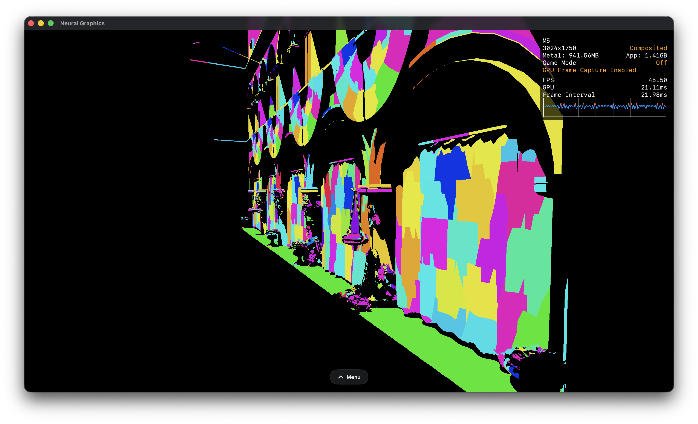

# Neural Graphics

This repository showcases various modern rendering techniques implemented using Metal 4 API, focused on GPU driven rendering, raytracing and neural graphics.

## Building and running

This project works on any Apple Silicon GPU, however M3+ is required for raytracing and mesh shader support.
Just run the AssetBaker project first, then you can build and run the main project.

## Current features

- Raytraced hard shadows
- Mesh shaders
- GPU driven debug renderer

## Work in progress

- GPU driven meshlet culling and LOD selection
- GPU driven acceleration structure building
